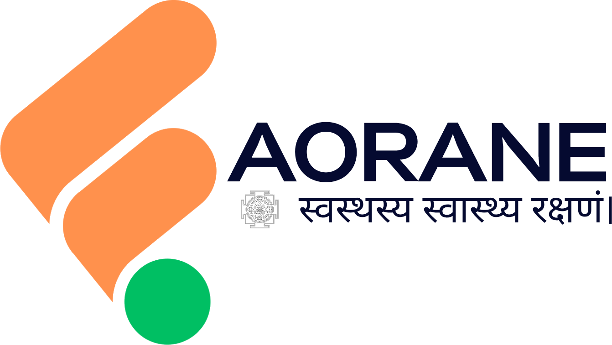
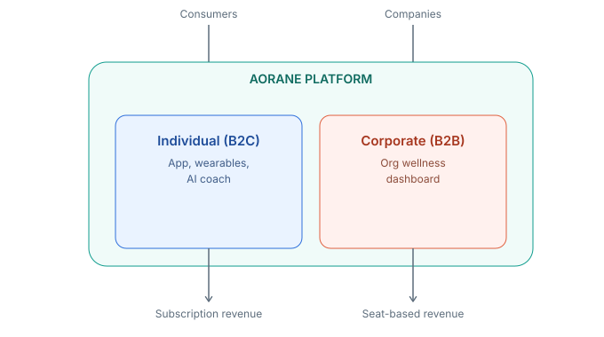
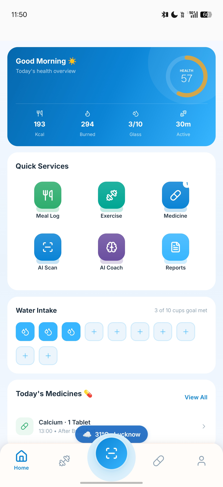
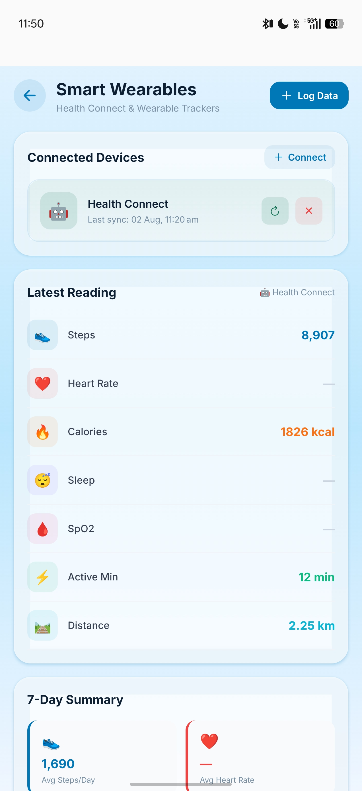
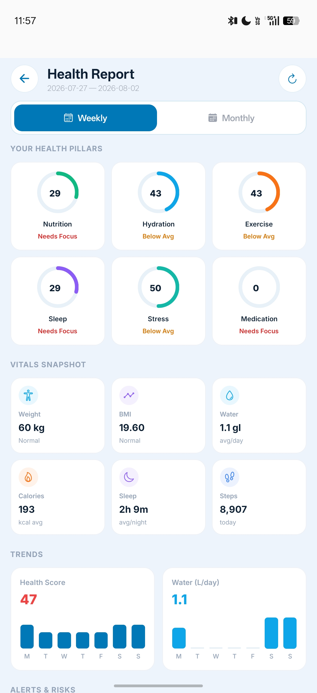
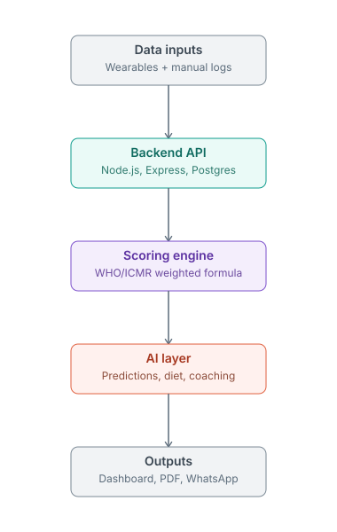

<div align="center">



### One health data engine. Two markets.

**AI-powered health tracking for individuals — and workforce wellness analytics for companies.**

[](#)
[](#)
[](#)
[](#)
[](#license)

[Request a Demo](#contact) · [Business Enquiry](#contact) · [How It Works](#-how-it-works)

</div>

---

## What is AORANE?

AORANE is a health-intelligence platform that turns everyday health data — steps, heart rate, sleep, food, exercise, medicine adherence — into a single, understandable **Health Score** and actionable **AI insights**. It serves two audiences from the same underlying engine: **individual consumers** through a mobile app, and **companies** through a workforce wellness dashboard that helps HR teams understand and improve employee health at scale.

---

## The Problem

- Health data is scattered — a wearable app here, a food-logging app there, a doctor's note somewhere else. No single number tells you "how healthy am I, really?"
- Companies spend on employee wellness with little visibility into whether it's working, or which employees are genuinely at risk.
- Existing wellness platforms are either too clinical (built for hospitals) or too shallow (just a step counter) — nothing bridges consumer engagement with employer-grade analytics.

## The Solution

AORANE closes this gap with **one scoring engine, two front doors**:

<div align="center">

</div>

### For Individuals
A mobile app that automatically syncs wearable data (Health Connect), logs food/exercise/medicine, and turns it into a daily Health Score, an AI coach, and shareable PDF health reports — no manual spreadsheets, no guesswork.

### For Businesses
An admin dashboard where HR/wellness teams enroll employees with a simple code, then see aggregate (privacy-respecting) workforce health metrics: average health score, at-risk employee counts, stress distribution, and an automatically-emailed monthly report — all without anyone touching a spreadsheet.

---

## Key Features

| | Individual (App) | | Corporate (Dashboard) |
|---|---|---|---|
| 🏆 | Daily Health Score (0–100) | 🏢 | Workforce health-score analytics |
| ⌚ | Automatic Health Connect sync | 🔑 | Simple enrollment codes for employees |
| 🍽️ | Food, water, exercise, medicine logging | 📊 | Healthy / at-risk / inactive employee breakdown |
| 🤖 | AI health coach + weekly diet plan | 📩 | Auto-emailed monthly report (AI-generated) |
| 📄 | Downloadable PDF health reports | 💳 | Seat-based billing, no per-feature upsells |
| 🔔 | Medicine & hydration reminders | 📈 | Stress-level & engagement tracking |

<div align="center">



</div>

---

## 🔧 How It Works

<div align="center">

</div>

In plain terms: data comes in from a wearable or a manual log → the backend runs it through a single **WHO/ICMR-referenced weighted formula** → the AI layer turns that into predictions and recommendations → the result shows up as a score, a report, or a chat message. Every surface (app, PDF report, corporate dashboard) reads from the *same* computed score — nothing is recalculated twice or shown inconsistently.

---

## Business Model & Revenue

| | Individual | Corporate |
|---|---|---|
| **Pricing** | Free / Pro / Max subscription tiers | Per-seat licensing + analytics tier |
| **What unlocks with tier** | AI coach depth, weekly diet plans, disease-risk predictions | Number of enrolled employees, report frequency, analytics depth |
| **Billing** | Razorpay subscription | Razorpay seat-based invoicing |

---

## Market Opportunity — Why This Is Worth Companies' Money

*(Figures below are established corporate-wellness industry benchmarks, not AORANE's own published results — AORANE's features are built to target exactly these outcomes.)*

| AORANE Feature | Business Outcome | Industry-Benchmarked Impact |
|---|---|---|
| Workforce health-score dashboard | Healthcare cost reduction | **$3.27 saved per $1 spent** on wellness (Harvard Business Review meta-analysis) |
| Stress-level tracking | Absenteeism reduction | **$2.73 saved per $1 spent**; **14–19% lower absenteeism** |
| Engagement tracking | Productivity | Up to **20% productivity increase** with strong engagement |
| Monthly AI report to HR | Retention | Employees **53% less likely to leave** companies visibly investing in wellbeing |
| Medicine adherence tracking | Chronic-condition claims reduction | Johnson & Johnson case study: **$250M saved over 10 years** |

**Best-fit company profiles:** IT/tech & BPO (sedentary lifestyle risk), manufacturing (chronic-illness-linked absenteeism), insurance-linked employers (premium negotiation data), remote/hybrid teams (engagement visibility gap), and mid-size companies (100–500 employees) without a dedicated wellness team.

---

## Tech Stack

<div align="center">


</div>

Multi-provider AI layer (switchable between providers), Health Connect for Android wearable data, Razorpay for payments, PDFKit for report generation — built as a pnpm monorepo so the mobile app, business dashboard, admin panel, and marketing site all share one backend and one set of business logic.

---

## Architecture Overview

```
AORANE/
├── aorane-mobile/      → Consumer app (React Native / Expo)
├── business-portal/    → Corporate HR/wellness dashboard
├── admin-panel/        → Internal operations dashboard
├── api-server/         → Single shared backend (Node.js + PostgreSQL)
└── aorane-landing/     → Marketing website
```

One backend, one scoring engine, one AI layer — every surface above just presents the same data differently. This is why adding a new customer segment doesn't mean building a new system.

---

## Roadmap

- [x] Individual app — Health Score, AI coach, Health Connect sync, PDF reports
- [x] Corporate dashboard — enrollment, workforce analytics, monthly AI reports
- [ ] WhatsApp-based logging & reminders
- [ ] iOS release
- [ ] Expanded corporate analytics (department-level breakdowns)

---

## Security & Data Privacy

Health data is sensitive by nature. AORANE stores it encrypted at rest, corporate dashboards only ever see **aggregate/anonymized** metrics (never an individual employee's raw logs), and authentication follows standard token-based practices across every surface.

---

## Contact

**Interested in a demo, a pilot for your company, or investment details?**

📧 [business@aorane.com](mailto:business@aorane.com) · 🌐 [aorane.com](https://aorane.com)

---

<div align="center">

<sub>© AORANE. All rights reserved. · MIT License for open-source components.</sub>

</div>
